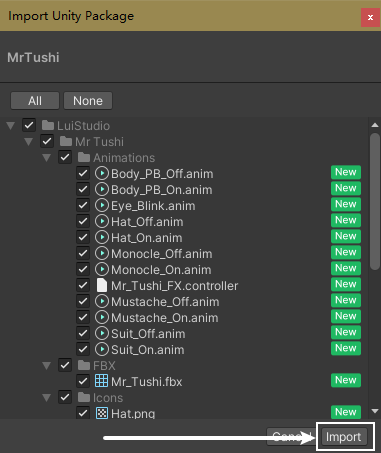
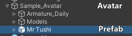
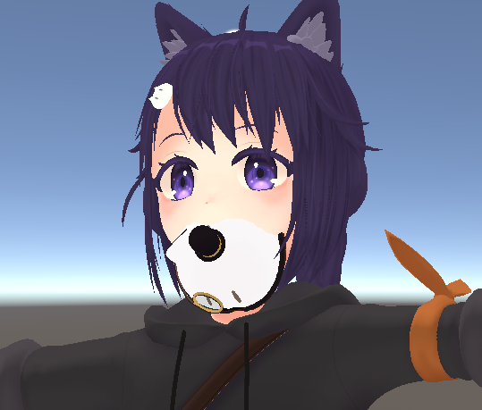
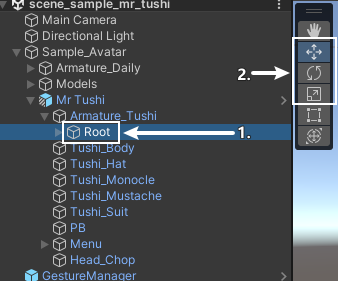
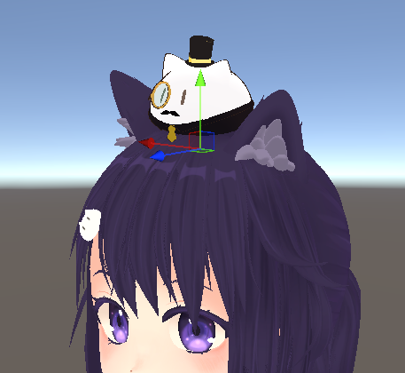

# Mr.Tushi v1.0 Instructions {ignore}

## Table of Contents {ignore}

<!-- @import "[TOC]" {cmd="toc" depthFrom=1 depthTo=6 orderedList=false} -->

<!-- code_chunk_output -->

- [Installation Instructions](#installation-instructions)
  - [Dependencies](#dependencies)
  - [Importing Unity Package](#importing-unity-package)
  - [Installing Mr.Tushi](#installing-mrtushi)
    - [1. Add Prefab to Scene](#1-add-prefab-to-scene)
    - [2. Adjust Position](#2-adjust-position)
    - [Well Done](#well-done)
- [How to Use](#how-to-use)
- [Miscellaneous](#miscellaneous)
  - [Change the Submenu Position in Action Menu](#change-the-submenu-position-in-action-menu)
  - [Hide Mr.Tushi in VRChat Avatar Preview](#hide-mrtushi-in-vrchat-avatar-preview)

<!-- /code_chunk_output -->

## Installation Instructions

### Dependencies

This gimmick relies on the following Unity plugins / shaders. Make sure you have installed them before you install this gimmick.

- Modular Avatar (1.9.13 or higher): https://modular-avatar.nadena.dev/
- lilToon (1.7.3 or higher): https://lilxyzw.github.io/lilToon/#/
- Gesture Manager (3.9 or higher): https://github.com/BlackStartx/VRC-Gesture-Manager

Dependencies end

---

### Importing Unity Package

Drag `Mr Tushi.unitypackage` into `Project` window, click the `Import` button on the dialog to import the package to your avatar project:

Importing Unity Package end

---

### Installing Mr.Tushi

#### 1. Add Prefab to Scene

Find `Assets/LuiStudio/Mr Tushi/Mr Tushi.prefab` and drag it into your avatar, after the dragging, the hierarchy should as below:

#### 2. Adjust Position

After finishing the previous step, we can see Mr.Tushi is fixed to avatar's head:

Select `Mr Tushi/Armature_Tushi/Root`[1] in Hierarchy window, use the `Move Tool`, `Rotate Tool` and `Scale Tool`[2] to move Mr.Tushi above avatar's head:

The reference for the position:

#### Well Done

You have done the installation. Head to [How to Use](#how-to-use) and try it in VRChat.

Installation Instructions end

---

## How to Use

You've done the installation, it's time to try it out in VRChat.

- Turn on the action menu, locate the toggle called `Hypnosis Phone`, when toggles on, the phone will appear.
- Use the hand other than the holding hand and tap on the `Start` button on the screen to start the hipnosis animation.
- Use the hand other than the holding hand again and tap on the middle of the screen to stop the hipnosis animation.
Turn on the action menu, locate and enter the `Mr.Tushi` submenu, the toggles in the submenu are for showing/hiding specific models.

How to Use end

---

## Miscellaneous

### Change the Submenu Position in Action Menu

The submenu is installed to the root menu by default, that's not friendly to avatars having many other gimmicks. We can change the position of it by editing `MA Menu Installer` component:

- Select `Mr Tushi/Menu/Mr.Tushi` in Hierarchy window;
- Head to Inspector window, click on the `Select Menu` inside the `MA Menu Installer` component;
- Select the menu where you want to install the submenu into.

### Hide Mr.Tushi in VRChat Avatar Preview

Select objects below in Hierarchy window:

- `Mr Tushi/Tushi_Body`
- `Mr Tushi/Tushi_Hat`
- `Mr Tushi/Tushi_Monocle`
- `Mr Tushi/Tushi_Mustache`
- `Mr Tushi/Tushi_Suit`

After finishing the selection, uncheck the checkbox at the top of the Inspector window.

Miscellaneous end