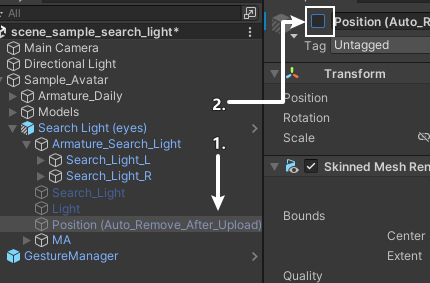
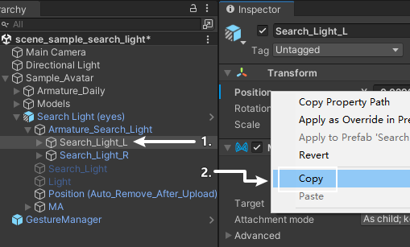
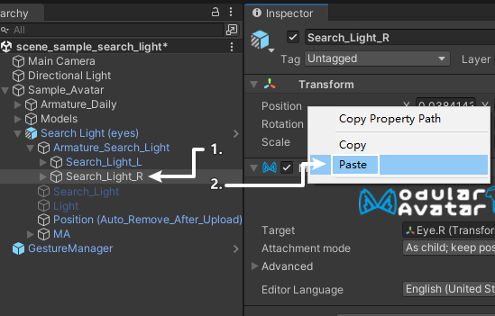
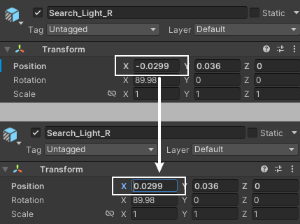

# Search Light v1.1 Instructions {ignore}

## Table of Contents {ignore}

<!-- @import "[TOC]" {cmd="toc" depthFrom=1 depthTo=6 orderedList=false} -->

<!-- code_chunk_output -->

- [Installation Instructions](#installation-instructions)
  - [Dependencies](#dependencies)
  - [Importing Unity Package](#importing-unity-package)
  - [Installing Search Light](#installing-search-light)
    - [1. Add Prefab to Scene](#1-add-prefab-to-scene)
    - [2. Reposition](#2-reposition)
      - [1. Roughly Move Search Lights](#1-roughly-move-search-lights)
      - [2. Adjust Search Lights for Both Eyes](#2-adjust-search-lights-for-both-eyes)
        - [1. Adjust for Left Eye](#1-adjust-for-left-eye)
        - [2. Adjust for Right Eye](#2-adjust-for-right-eye)
      - [3. Hide the Position Indicator (Optional)](#3-hide-the-position-indicator-optional)
    - [Well Done](#well-done)
- [How to Use](#how-to-use)
- [Miscellaneous](#miscellaneous)
    - [Set the Size and Length for Light Pillar](#set-the-size-and-length-for-light-pillar)
    - [Change the Switch Position in Action Menu](#change-the-switch-position-in-action-menu)

<!-- /code_chunk_output -->

## Installation Instructions

### Dependencies

This gimmick relies on the following Unity plugins / shaders. Make sure you have installed them before you install this gimmick.

- Modular Avatar (1.9.13 or above): https://modular-avatar.nadena.dev/
- lilToon (1.7.3 or above): https://lilxyzw.github.io/lilToon/#/

Dependencies end

---

### Importing Unity Package

Drag `Search Light.unitypackage` into `Project` window, click the `Import` button on the dialog to import the package to your avatar project:

{width=50%}

Importing Unity Package end

---

### Installing Search Light

#### 1. Add Prefab to Scene

> :warning: **Attention**
>
> Due to the limitation of Modular Avatar, a exception would be thrown if the target is empty in `MA Bone Proxy` component. Though most of avatars contain eye bones, i remained prefab with target asigning head bone instead of eye bones to prevent error.

Check your avatar to make sure if it contains eye bones to add the currect prefab as below:

- Contains eye bones: `Search Light (eyes).prefab`
- No eye bones, or yes eye bones but you do not want the light to follow the gaze: `Search Light (head).prefab`

Drag the satisfied prefab from `Assets/LuiStudio/Search Light` to your avatar. Hierarchy should be like:

#### 2. Reposition

There's a position indicator model for better experience, the model will be automatically removed after build / upload.

##### 1. Roughly Move Search Lights

Select `Armature_Search_Light`[1] under the added prefab, use the `Move Tool` and `Rotate Tool`[2] and move the Search Light in front of avatar's eyes:

It should look like this after the movement:

##### 2. Adjust Search Lights for Both Eyes

We need to align the search lights to both eyes after the roughly move. In this instructions, we'll adjust the search light for left eye, then we make the search light for right eye symmetrical based on the coordinates of the left eye.

###### 1. Adjust for a Single Eye (Left Eye Example)

In the Hierarchy, select `Search_Light_L` under `Armature_Search_Light`[1], and use Unity's `Move` and `Rotate`[2] tools to align the light beam to the front of the left eye[3]:

After adjustment, the light beam for the other eye will automatically mirror the position of the adjusted eye.

###### 2. Cancel Symmetry (Optional)

In the Hierarchy, select the prefab, go to the Inspector, find and remove the `Search Light Symmetry Tool` component.

##### 3. Remove Position Indicator Model (Optional)

In older versions of VRCSDK, the position indicator model (the blue light pillar) may not be automatically removed. In this case, you need to remove it manually.

Select `Position (Auto_Remove_After_Upload)` and uncheck the active box in the Inspector:

#### Well Done

You have done the installation, head to [How to Use](#how-to-use) and try it in VRChat.

Installing end

---

## How to Use

You've done the installation, it's time to try it out in VRChat.

- Turn on the action menu, locate the Search Light switch, turn it on/off to show/hide the search light.

How to Use end

---

## Miscellaneous

### Set the Size and Length for Light Pillar

There are 2 bones for each search light, which can set the size and length for the light pillar if we adjust their scale and position.

### Change the Switch Position in Action Menu

The switch is installed to the root menu by default, that's not friendly to avatars having many other gimmicks. You can change the position of the switch using Modular Avatar:

- Select `Menu/Search Light` under the prefab in Hierarchy.
- Head to the Inspector, click on the `Select Menu` inside the `MA Menu Installer` component.
- Select the submenu where you want to put in.

### What if the light beams for both eyes are not automatically symmetrical?

If the beams are not symmetrical, or if the symmetry component reports an error, you need to manually mirror the light beams. Assuming you have already adjusted the beam for the left eye, follow these steps to make the right eye beam symmetrical to the left eye:

Select `Search_Light_L`[1], head to Inspector, right click on Position under Transform, and click on `Copy`[2]:

Select `Search_Light_R`[1], head to Inspector, right click on Position under Transform, and click on `Paste`[2]:

Make the X axis value opposite in Position:

Miscellaneous end
