# LED マスク v1.0 使用説明書 {ignore}

>:warning: **注意**
>
>こちらの説明書は ChatGPT によって生成されました。翻訳には誤りが含まれる可能性があります。誤りがある場合はご容赦ください。

## 目次 {ignore}

<!-- @import "[TOC]" {cmd="toc" depthFrom=1 depthTo=6 orderedList=false} -->

<!-- code_chunk_output -->

- [インポート手順](#インポート手順)
  - [インポート前の準備](#インポート前の準備)
  - [アセットパッケージのインポート](#アセットパッケージのインポート)
  - [対応したアバターのインポート手順](#対応したアバターのインポート手順)
    - [1. DLC パッケージのインポート](#1-dlc-パッケージのインポート)
    - [2. Prefab のインポート](#2-prefab-のインポート)
    - [3. テスト](#3-テスト)
    - [インポート完了](#インポート完了)
  - [未対応アバターのインポート手順](#未対応アバターのインポート手順)
    - [1. Prefab のインポート](#1-prefab-のインポート)
    - [2. マスク形状の調整](#2-マスク形状の調整)
      - [1. マスク中央部分の調整](#1-マスク中央部分の調整)
      - [2. マスク左側部分の調整](#2-マスク左側部分の調整)
      - [3. マスク右側部分の調整](#3-マスク右側部分の調整)
      - [4. （オプション）パターンのサイズ調整](#4-オプションパターンのサイズ調整)
    - [3. マスク表情のカスタマイズ](#3-マスク表情のカスタマイズ)
      - [1. （オプション）LEDパターン参考](#1-オプションledパターン参考)
      - [2. マスク表情設定ツールの初期化を行う](#2-マスク表情設定ツールの初期化を行う)
      - [3. マスク表情設定ツールを使用して表情をカスタマイズする](#3-マスク表情設定ツールを使用して表情をカスタマイズする)
        - [1. 不要なアニメーションレイヤーを解除](#1-不要なアニメーションレイヤーを解除)
        - [2. アニメーションレイヤー内の表情をプレビュー](#2-アニメーションレイヤー内の表情をプレビュー)
        - [3. マスクの表情を編集](#3-マスクの表情を編集)
        - [4. 残りの表情を編集](#4-残りの表情を編集)
        - [5. マスク表情の適用](#5-マスク表情の適用)
        - [6. テスト](#6-テスト)
        - [7. 注意事項](#7-注意事項)
    - [インポート完了](#インポート完了-1)
- [LEDパターンのカスタマイズ](#ledパターンのカスタマイズ)
  - [1. ツールを使ってパターンを作成](#1-ツールを使ってパターンを作成)
    - [1. パターン作成ツールの紹介](#1-パターン作成ツールの紹介)
    - [2. パターンの作成と保存](#2-パターンの作成と保存)
  - [2. パターンの使用](#2-パターンの使用)
    - [1. インポート設定](#1-インポート設定)
    - [2. パターンの置き換え](#2-パターンの置き換え)
- [使用方法](#使用方法)
- [その他](#その他)
  - [サブメニューのアクションメニュー内での位置変更](#サブメニューのアクションメニュー内での位置変更)

<!-- /code_chunk_output -->

## インポート手順

### インポート前の準備

この拡張機能は、以下の Unity プラグイン/シェーダーに依存しています。 インポートする前に、次のプラグインがインストールされていることを確認してください：

- Modular Avatar (1.9.13以上): https://modular-avatar.nadena.dev/
- lilToon (1.7.3以上): https://lilxyzw.github.io/lilToon/#/
- Gesture Manager (3.9以上): https://github.com/BlackStartx/VRC-Gesture-Manager

インポート前の準備完了

---

### アセットパッケージのインポート

`LED Mask.unitypackage` を Unity の `Project` ウィンドウにドラッグし、プロンプトが表示されたら `Import` をクリックして、アセットパッケージを Avatar プロジェクトにインポートします。

アセットパッケージのインポート完了

---

### 対応したアバターのインポート手順

#### 1. DLC パッケージのインポート

ダウンロードした DLC リソースを見つけ、その中の `unitypackage` ファイルを Unity の `Project` ウィンドウにドラッグし、プロンプトが表示されたら `Import` をクリックして、アセットパッケージをプロジェクトにインポートします。

#### 2. Prefab のインポート

`Project` ウィンドウで、`Assets/LuiStudio/LED Mask/Prefabs` に移動し、アバター素体の名前が付いている Prefab を見つけます（本チュートリアルでは[しろいののにゃにゃし](https://siroinoworks.booth.pm/items/6082750)を例とします）。以下の画像をご覧ください：

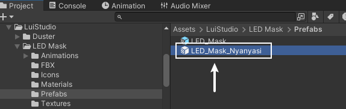

この Prefab をアバターにドラッグします。ドラッグ後の Prefab とアバターの関係は次のようになります：

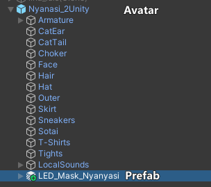

#### 3. テスト

`Gesture Manager` を使用して `Play Mode` に入り、アクションメニューでLEDマスクを見つけてオンにし、ジェスチャーを変更してマスクの表情をテストします。

> :warning: **注意**
>
> もしマスクの表情に満足できず、表情を変更したい場合、手動での変更は非常に煩雑ですので、[マスク表情のカスタマイズ](#3-マスク表情のカスタマイズ)に従ってアバターを再度対応させることをお勧めします。
>
> 手動で変更したい場合は、以下の情報が役に立つかもしれません：
>
> マスクPrefabの `MA Merge Animator` コンポーネントでは、最初のアニメーターがマスクの形状変化に、2つ目がマスクのデザインに作用します。内部のアニメーターコントローラーの内容は、アバターのFXレイヤーコントローラーで表情を管理するアニメーションレイヤーと同様である必要があります。
>
> 通常、3 つ目の `MA Merge Animator` コンポーネントのコントローラーは変更しないでください。

#### インポート完了

対応したアバターのLEDマスクのインポートが完了しました。次に、[使用方法](#使用方法)をご覧ください。

対応したアバターのインポート手順完了

### 未対応アバターのインポート手順

#### 1. Prefab のインポート

`Project` ウィンドウで、`Assets/LuiStudio/LED Mask/Prefabs` に移動し、 `LED_Mask.prefab` を見つけます。以下の画像をご覧ください：

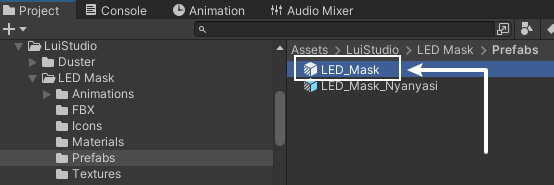

この Prefab をアバターにドラッグし、**アバター内に LED マスクの Prefab が一つだけ存在することを確認**します。ドラッグ後の Prefab とアバターの関係は次のようになります：

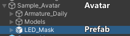

#### 2. マスク形状の調整

>:warning: **注意**
>
> この手順の前に、シーンウィンドウの左上にある `Tool Settings` を `Pivot（ピボット）` と `Local（ローカル）` に設定してください[1]：
>
> 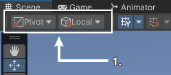

各アバターの顔の形状や骨格が異なるため、LED マスクの形状を自身のアバターに合わせて調整する必要があります。

`Hierarchy` 内で `LED マスク Prefab/Armature_LED_Mask/Root`[1] を選択したまま、シーン内で `移動ツール`、`回転ツール`、および`スケールツール`[2] を使用して、マスクの位置、回転、サイズを大まかに調整します：

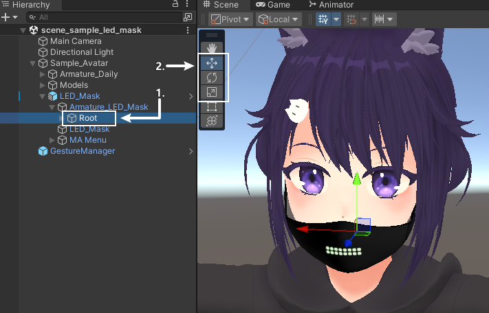

>:warning: **注意**
>
> アバターのいずれかの部位がマスク位置の確認を妨げている場合は、`Hierarchy` 内で一時的に非表示にすることができます。

粗調整が完了すると、以下のようになります：

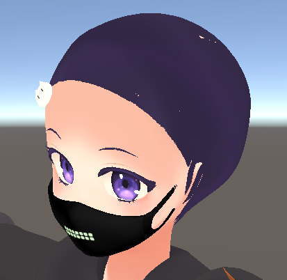

マスクがまだアバターの頬に完全にフィットしていないので、マスクの各部位を微調整する必要があります。`Root` を展開すると、マスクのさまざまな部位に対応するボーンが表示されます：

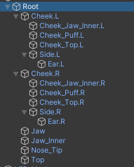

一見複雑に見えますが、各部位を分けて順番に調整すれば簡単に行えます：

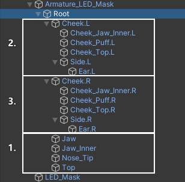

3 つの部分に分けましたので、以下ではそれぞれの部分を順番に調整していきます。

##### 1. マスク中央部分の調整

この部分のボーンには `Jaw`、`Jaw_Inner`、`Nose_Tip`、`Top` が含まれています。これらのボーンに対応する部位は下図のとおりです：

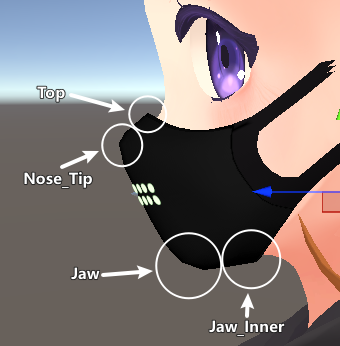

該当するボーンを選択し、`移動` や `回転` ツールを使用して必要な部位を微調整します。

満足のいく位置に調整したら、次の図のようにします：

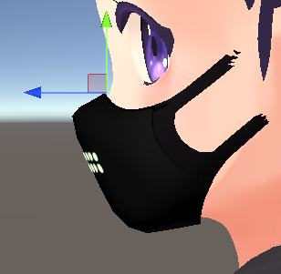

##### 2. マスク左側部分の調整

この部分のボーンには `Cheek.L`、`Cheek_Jaw_Inner.L`、`Cheek_Puff.L`、`Cheek_Top.L`、`Side.L`、`Ear.L` が含まれています。これらのボーンに対応する部位は下図のとおりです：

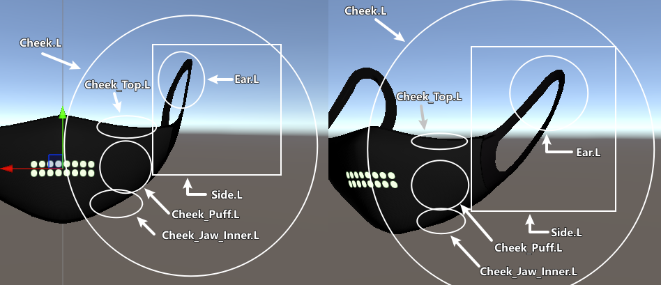

ボーンのHierarchyに基づき、外側から内側へ順に調整してください。例えば、以下の順番で調整します：

- Cheek.L
- Cheek_Jaw_Inner.L、Cheek_Puff.L、Cheek_Top.L、Side.L
- Ear.L

満足のいく位置に調整したら、次の図のようにします（私の Avatar に耳がないことは無視してください :sob:）：

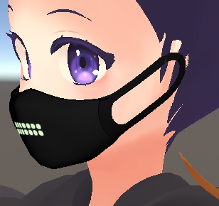

##### 3. マスク右側部分の調整

マスク右側のボーンの位置は、基本的にマスク左側のボーンを対称に配置することになります（アバターの頭部が対称である場合）。
左側のボーンを右側の対応するボーンに対称コピーするためのツールを提供しています。

Unity のトップメニューから `Tools > LuiStudio > LED Mask > Mirror Bones` をクリックして、`Mirror LED Mask Bones` ウィンドウを開き、Avatar の LED マスク Prefab をウィンドウの `LED Mask` 部分にドラッグしてください：

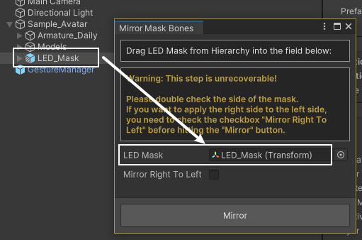

もし移動対象のボーンが右側のボーンの場合は、ウィンドウ内の `Mirror Right To Left` にチェックを入れてください。

ウィンドウ内の `Mirror` ボタンをクリックすると、マスクが左右対称になります：

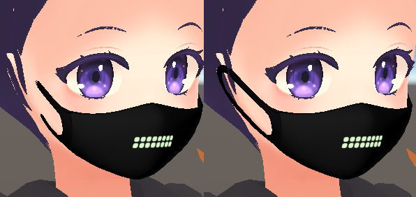

> :warning: **注意**
>
> マスクが予期した方向に対称コピーされない場合は、Ctrl + Z で操作を元に戻してください。

##### 4. （オプション）パターンのサイズ調整

マスクの形状を調整した結果、マスクが広すぎたり狭すぎたりしてパターンが変形する場合、マスクのLEDシェーダー設定を調整して修正することができます。  

Hierarchy で `LED 口罩 Prefab/LED_Mask`[1] を選択し、Inspector の最下部で `LED (Material)`[2] を展開して、`LED Tiling`[3] プロパティを見つけます。その `X` と `Y`[4] の値を調整して満足のいく結果になるまで調整してください：

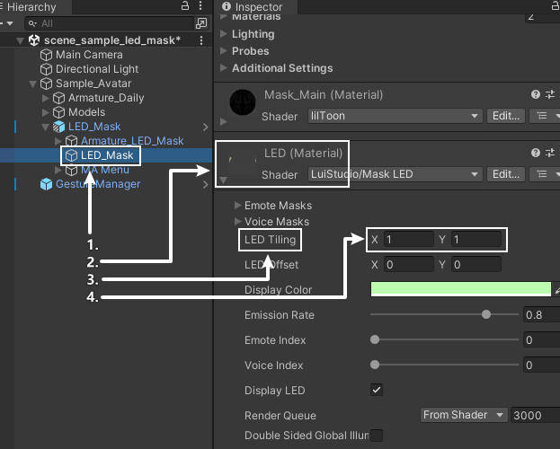

#### 3. マスク表情のカスタマイズ

##### 1. （オプション）LEDパターン参考

マスクLEDのパターン参考は、後続の手順に役立ちます。
Hierarchy の `LED 口罩 Prefab/LED_Mask`[1] を選択し、Inspector に移動して一番下にある `LED (Material)` を見つけて展開します。中にある `Emote Masks`[2] テクスチャリストがマスク表情のパターン参考となります。`Emote` の後の数字がパターン番号です。Inspector ウィンドウの右上にある :unlock:[3] をクリックして、この Inspector ウィンドウをロックしてください：

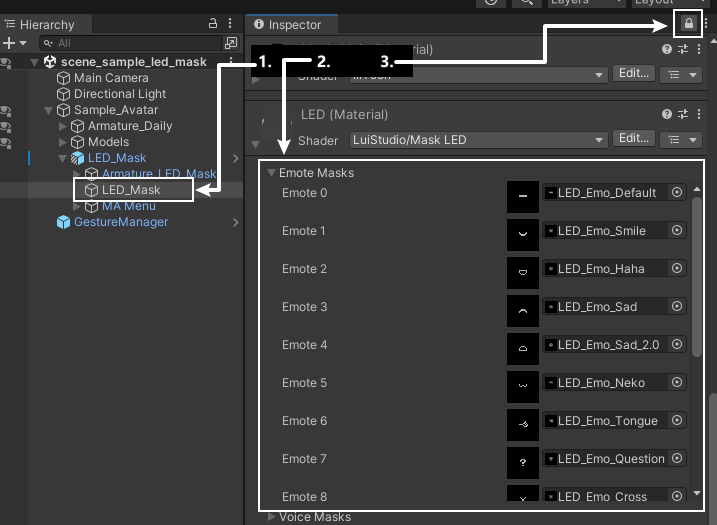

新しい `Inspector` を作成して、他の操作を行います。
`Inspector` ウィンドウの `Inspector` タブを右クリックし、`Add Tab -> Inspector`を選択します：

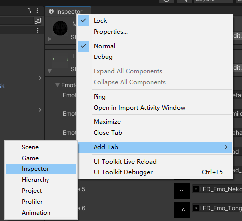

> :warning: **注意**
>
> ウィンドウのタブをドラッグすることで、ウィンドウを自由に移動し、好きな場所にドッキングさせることができます。マスク表情の参考用 `Inspector` ウィンドウを新しい `Inspector` ウィンドウの外側にドラッグすることをお勧めします。これにより、後の操作が簡略化されます。

##### 2. マスク表情設定ツールの初期化を行う

マスク表情設定ツールを使用すると、現在のアバターのFXアニメーションレイヤーのアニメーションをプレビューでき、Unity の `Animation` ウィンドウを組み合わせて、`LED マスクの表情模様を設定` したり、`マスクとアバターの衝突を処理` することが簡単に行えます。

> :warning: **注意**
>
> マスク表情設定ツールは、まだ完全なテストが行われていないため、**モデルファイル**を事前にバックアップすることをお勧めします。
>
> **バックアップなし**で本ツールを使用して何らかの損失が生じた場合、LuiStudio は一切の責任を負いません。
> 使用中に発生したバグの報告を歓迎します。
>
> このツールは、Unity で `Animation` ウィンドウが開かれていない場合、自動的に `Animation` ウィンドウを起動します。必ず `Animation` ウィンドウを開いてください。

Unity のトップメニューから `Tools > LuiStudio > LED Mask > Setup Animator Controller` を選択して、設定ツールを起動します。`Hierarchy` 内のアバター[1]をウィンドウ内の `Avatar`[2] にドラッグして入れ、ツールが初期設定を完了するのを待ちます（初期設定の時間は FX レイヤーのアニメーションコントローラーの複雑さによって変わります）：

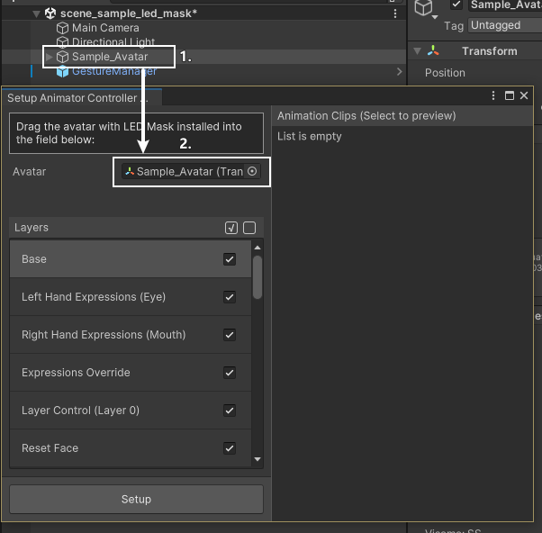

##### 3. マスク表情設定ツールを使用して表情をカスタマイズする

###### 1. 不要なアニメーションレイヤーを解除

まず、**表情に関係のない**アニメーションレイヤーのチェックを外します。チェックを外すと、最終的なアニメーションコントローラーにそのアニメーションレイヤーが含まれなくなります。アニメーションレイヤーリストの各項目の右側にある `チェックボックス`[1] をクリックして `チェック/チェック解除` を行い、必要に応じて `全選択/全解除` ボタン[2]を使用できます：

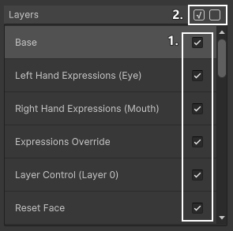

例として、削除後のアニメーションレイヤーは以下のようになります：

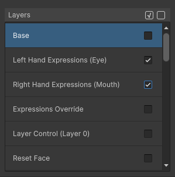

###### 2. アニメーションレイヤー内の表情をプレビュー

`Layers` 欄でアニメーションレイヤー[1] を選択し、右側の `Animation Clips` 欄でアニメーションをクリックする[2] と、シーンでアニメーションをプレビューできます[3]（もう一度クリックするとプレビューを停止します）：

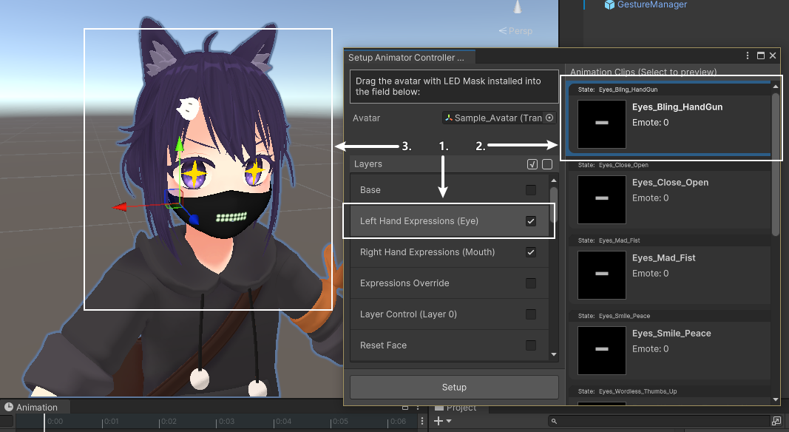

> :warning: **注意**
>
>上記のプレビューは、Avatar の Animator コンポーネント内のアニメーションコントローラを切り替え、Animation ウィンドウでプレビュー機能を有効にすることでプレビューします。通常、プレビューを停止するとアニメーションコントローラが元に戻ります（ツールを起動してアニメーションをプレビューしている際に、Unity を正常に終了しないと、コントローラーの復元に失敗する可能性があります）。

###### 3. マスクの表情を編集

プレビュー中に、Animation ウィンドウで表情を編集できます。

> :warning: **注意**
>
>マスクのカスタマイズを最大限にするため、この手順では Unity の Animation ウィンドウを直接使用してアニメーションを編集します。Unity のアニメーション操作に不慣れな方は、以下の手順に完全に従ってください。

**マスクのデザインを編集**

Animation ウィンドウに移動し、**`収録モード` を有効にする[1]**。タイムライン上の `LED_Mask : ..._Emote Index`[2] はマスクのデザインインデックスで、他の属性は Avatar の表情アニメーションの属性です。デザインインデックスの値（0～15）[3] を変更して、マスクのデザインを変更します、もしデフォルト値を使用したい場合（詳細は [注意事項 - (2)](#7-注意事項) を参照）、インデックスプロパティを直接削除してください。：

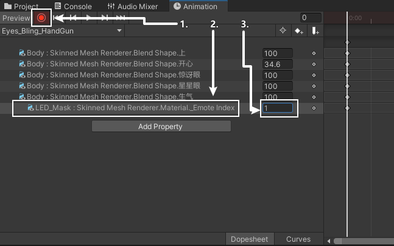

調整後の例：

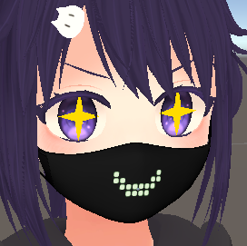

**干渉の解消**

マスクが Avatar と干渉する場合は、以下の提案に従って編集します（このセクションでは [しろいの の にゃにゃし](https://siroinoworks.booth.pm/items/6082750) の頬を膨らませる表情を例にします）：

>:warning: **注意**
>
>Avatar の元の表情を参照したい場合、マスクが干渉しているときは Hierarchy のマスク Prefab 左側の目のアイコンをクリックして、一時的にシーンでマスクを非表示にできます。

- **Avatar の顔の変形による干渉**

  例：

  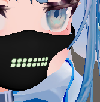

  **この場合、マスクの形状を編集することをお勧めします：**

  Animation ウィンドウで **`収録モード` が有効のまま**[1]、LED マスクの適切な部位（ここでは左頬）[2] のボーンを選択し、`移動`、`回転`、および `スケール` ツールを使用して調整します[3]：

  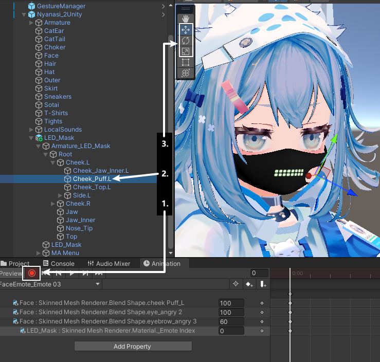

  調整後の例：

  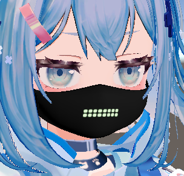

  にゃにゃし、かわいいですね

- **Avatar の漫画的な表現とマスクの干渉**

  例：

  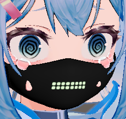

  **この場合、漫画表現またはマスクの形状を調整することをお勧めします：**

  この例では、上部の涙はマスクの形状を調整して涙が完全に表示されるようにするのが良いと考えます。
  
  Animation ウィンドウで **`収録モード` が有効のまま**、前述の移動手順に従い、マスクの上部縁を調整します。調整後は以下のようになります：

  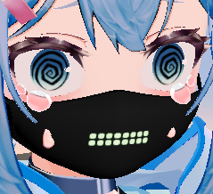

  下部の汗はシェイプキーで隠すのが良いと考えます。
  一般的に、漫画表現は顔のメッシュ内の `シェイプキー` によって移動されるため、この手順も `シェイプキー` 形式の漫画表現を例にします。Avatar の漫画表現が独立した GameObject の場合は、前述の移動手順に従ってください。
  &#10;
  Animation ウィンドウで **`収録モード` が有効のまま**[1]、Hierarchy 内で表情のシェイプキーを含む Avatar の GameObject（通常 `Body` または `Face`）[2] を見つけます。選択後、Inspector で `SkinnedMeshRenderer` コンポーネントを見つけ、その `BlendShapes`[3] を展開し、漫画表現のシェイプキーを調整します：

  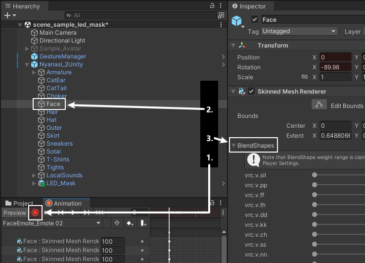

  調整後の例：

  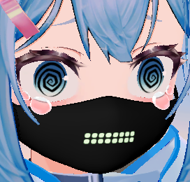

  にゃにゃし、かわいいですね

###### 4. 残りの表情を編集

[アニメーションレイヤー内の表情をプレビュー](#2-アニメーションレイヤー内の表情をプレビュー) と [マスクの表情を編集](#3-マスクの表情を編集) を繰り返し、すべての表情を編集します。

###### 5. マスク表情の適用

すべての表情のカスタマイズが完了したら、ウィンドウ内の `Setup` ボタンをクリックし、LED マスク用のアニメーションコントローラが生成されるのを待ちます。
生成されたコントローラは、LED マスク Prefab の MA Merge Animator コンポーネントに自動的に適用されます。

###### 6. テスト

`Gesture Manager` を使用して `Play Mode` に入り、アクションメニューで LED マスクのスイッチをオンにし、Avatar のジェスチャーを切り替えてマスクの表情が正常に表示されるか確認します。

###### 7. 注意事項

- (1) 各アニメーションレイヤーについて
  設定ツールでアニメーションレイヤーの数を 1 以上に設定した場合（例: この例の [しろいの の にゃにゃし](https://siroinoworks.booth.pm/items/6082750) には手勢アニメーションのレイヤーと、頭を撫でるアニメーションのレイヤーが含まれています）、アニメーションレイヤーの重ね合わせに注意してください。後のレイヤーのアニメーションが、前のレイヤーの同じパラメーター値を上書きします。
- (2) 異なる Write Defaults（以下 WD）によるマスクのデフォルト状態について
  デフォルト状態とは、マスクの表情アニメーションに該当する属性がない場合のその属性の値です。例えば、アニメーションにマスクのデザインインデックス属性がない場合のデザインインデックス値。
  Avatar の FX レイヤーアニメーションコントローラの各状態には WD オプションがあり、任意の状態の WD オプションを確認して Avatar が WD On か WD Off を採用しているかを確認します。異なる WD オプションのデフォルト状態は以下の通りです：
  - 有効
    Avatar が WD On を使用している場合、マスクのデフォルト状態はシーンの編集モード（プレビュー状態および再生モードではない状態）でのマスクの状態になります。
  - 無効
    Avatar が WD Off を使用している場合、このツールは生成されたアニメーションコントローラにデフォルトマスク表情レイヤーを追加します。この場合、アニメーション表情レイヤーは `Setup` ボタンをクリックしたときの編集モード（プレビュー状態および再生モードではない状態）でのマスクの状態になります。
  つまり、Avatar が WD On を使用し、デフォルト表情を変更したい場合は、編集モードでマスクを直接編集すればよく、WD Off の場合は `Setup` ボタンを押す前に編集モードでマスクを編集する必要があります。
- (3) マスク LED デザインインデックスのキーフレームの問題
  マスク表情アニメーションを編集中にマスクのデザインインデックス属性（..._Emote Index）を削除し、再追加する必要がある場合は、追加後にキーフレームのカーブを定数カーブに変更してください。具体的な手順は以下の通りです：
  マスクのデザインインデックス属性下[1] のキーフレームを選択し、キーフレームカーブのドロップダウンメニュー[2] をクリックし、`Constant`[3] を選択します：

  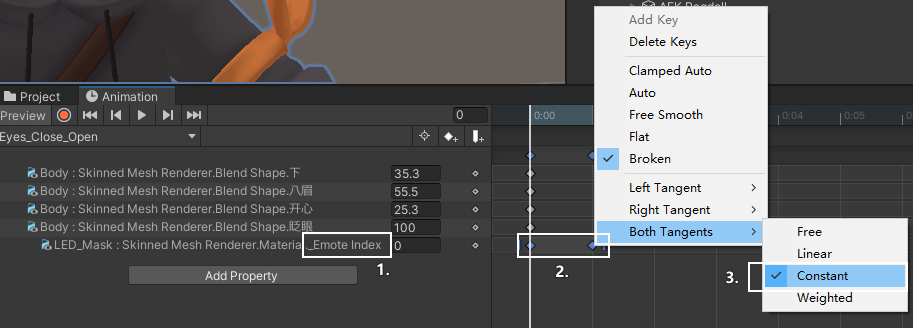

#### インポート完了

未適用のモデル用 LED マスクのインポートが完了しました。次に、[使用方法](#使用方法) をご確認ください。

インポート手順完了

---

## LEDパターンのカスタマイズ

マスクのLEDシェーダーは16種類の表情パターンと4種類の音量フィードバックパターンに対応しています。上記のステップで言及した「マスクパターンインデックス」は、16種類の表情パターンに対応しています。  
LEDシェーダーのテクスチャはマスクとして使用され、ピクセルの赤色値が高いほどそのピクセルの透明度が低くなります。自作のテクスチャをインポートするか、LED パターンペインターを使用してパターンを生成してインポートすることが可能です。

### 1. ツールを使ってパターンを作成

このギミックには、パターンを作成し、テクスチャファイルとして生成してUnityにインポートするためのツールが付属しています。

#### 1. パターン作成ツールの紹介

このマニュアルが保存されているフォルダで、`LEDPatternPainter/painter.html` を探し、ブラウザで開きます。
ツールの画面は以下のようになっています：

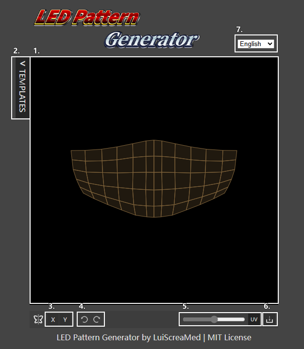

図中の各インターフェースの説明は以下の通りです：

1. キャンバス
2. テンプレートパターンリストの切り替え、キャンバスにテンプレートを適用するためのもの
3. X / Y軸の対称スイッチ、オンにすると描画および消去操作が対称軸に基づいて対称的に行われます
4. 元に戻す / やり直しボタン
5. UV表示ボタンで、マスクLEDパターン領域のUVを表示 / 非表示
6. パターン画像ファイル保存ボタン
7. 言語メニュー

#### 2. パターンの作成と保存

キャンバスで左クリックを押しながらLEDドットを描画し、右クリックで消去します。テンプレートパターンで「None」を選択するとキャンバスがクリアされます。  
パターンがUV範囲内に収まるように描画してください。範囲外の場合、使用時にシェーダーのプロパティを調整する必要があります。

保存ボタンをクリックしてパターンを保存し、保存したファイルを探してUnityのProjectウィンドウにドラッグ＆ドロップし、名前を変更してください。

### 2. パターンの使用

#### 1. インポート設定

Projectウィンドウでインポートしたパターンテクスチャを選択し、Inspectorで `Advance`[1]を展開して`Read/Write`[2]と `Mip Streaming`[3]にチェックを入れ、`Max Size`を`512`[4]に変更し、`Apply`[5]をクリックします：

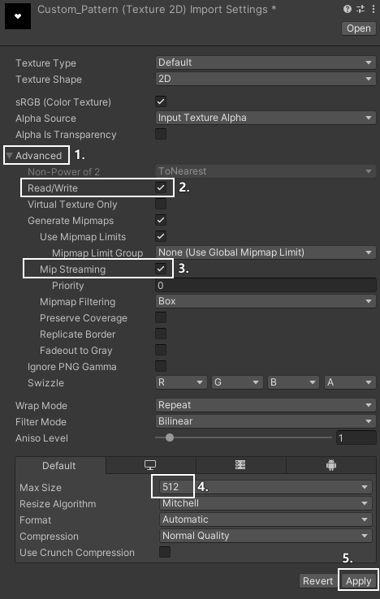

#### 2. パターンの置き換え

Hierarchyで `LED マスク Prefab/LED_Mask`[1]を選択し、Inspectorの一番下で `LED (Material)`[2]を展開し、`Emote Masks`[3]を展開して、置き換えたいパターンを選択したパターンに置き換えます：

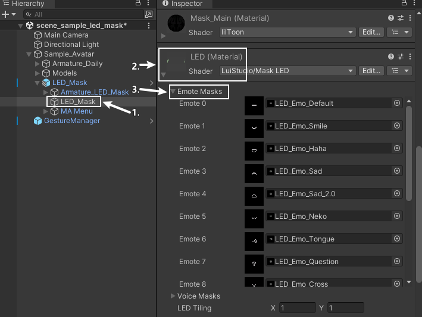

置き換え後は、マスクの表情アニメーションで `Emote Masks` のマスクパターンインデックスからパターンを選択できます。

LEDパターンのカスタマイズ完了

---

## 使用方法

インポートは完了しました。次に、VRChat での LED マスクの使用方法を説明します。
アクションメニューを開き、LED Mask サブメニューを探してください。その中には以下のオプションがあります：

- Mask: マスクの表示 / 非表示を切り替えます
- LED: マスク上のLEDの表示 / 非表示を切り替えます
- Voice: マスクLEDの音声フィードバックのオン / オフを切り替えます
- Color: マスクLEDの色を調整します
- Emission: マスクLEDの発光度を調整します

使用方法完了

---

## その他

### サブメニューのアクションメニュー内での位置変更

LED マスクのサブメニューの入口は、デフォルトでメニューの最初の層に配置されますが、これは多くの機能を持つ Avatar には使いにくいです。Modular Avatar を使用して、サブメニューの位置を変更できます。

- Hierarchy で `LED 口罩 Prefab/Menu/LED_Mask` を選択します
- Inspector で、`MA Menu Installer` コンポーネント内の `Select Menu` ボタンをクリックします
- 口罩サブメニューを配置したいメニューを選択します

その他完了