# 鸡毛掸子 v1.0 使用说明 {ignore}

## 目录 {ignore}

<!-- @import "[TOC]" {cmd="toc" depthFrom=1 depthTo=6 orderedList=false} -->

<!-- code_chunk_output -->

- [导入教程](#导入教程)
  - [导入前的准备](#导入前的准备)
  - [资源包导入](#资源包导入)
  - [导入普通版本](#导入普通版本)
    - [1. 导入Prefab](#1-导入prefab)
    - [2. 调整鸡毛掸子的位置](#2-调整鸡毛掸子的位置)
      - [1. 显示鸡毛掸子模型](#1-显示鸡毛掸子模型)
      - [2. 调整位置](#2-调整位置)
      - [3. 隐藏鸡毛掸子模型](#3-隐藏鸡毛掸子模型)
    - [导入完成](#导入完成)
  - [导入可作为武器使用（倒过来拿）的版本](#导入可作为武器使用倒过来拿的版本)
    - [1. 导入Prefab](#1-导入prefab-1)
    - [2. 调整鸡毛掸子在右手（普通状态）的位置](#2-调整鸡毛掸子在右手普通状态的位置)
    - [3. 调整鸡毛掸子在左手（武器状态）的位置](#3-调整鸡毛掸子在左手武器状态的位置)
      - [1. 显示鸡毛掸子模型](#1-显示鸡毛掸子模型-1)
      - [2. 将 Avatar 上的 Animator 组件关闭](#2-将-avatar-上的-animator-组件关闭)
      - [3. 将鸡毛掸子显示在左手](#3-将鸡毛掸子显示在左手)
      - [4. 调整位置](#4-调整位置)
      - [5. 取消预览鸡毛掸子在左手的动画](#5-取消预览鸡毛掸子在左手的动画)
      - [6. 重新开启 Avatar 上的 Animator 组件](#6-重新开启-avatar-上的-animator-组件)
      - [7. 隐藏鸡毛掸子模型](#7-隐藏鸡毛掸子模型)
    - [导入完成](#导入完成-1)
- [使用方法](#使用方法)
  - [普通版本使用方法](#普通版本使用方法)
  - [可作为武器使用（倒过来拿）的版本使用方法](#可作为武器使用倒过来拿的版本使用方法)
- [杂项](#杂项)
  - [修改鸡毛掸子的大小](#修改鸡毛掸子的大小)
    - [1. 显示鸡毛掸子模型](#1-显示鸡毛掸子模型-2)
    - [2. 调整鸡毛掸子大小](#2-调整鸡毛掸子大小)
    - [3. 隐藏鸡毛掸子模型](#3-隐藏鸡毛掸子模型-1)
  - [修改开关在菜单中的位置](#修改开关在菜单中的位置)

<!-- /code_chunk_output -->

## 导入教程

### 导入前的准备

该扩展依赖以下Unity插件 / Shader，请在导入前确保已经安装：

- Modular Avatar (1.9.13或以上): https://modular-avatar.nadena.dev/
- lilToon (1.7.3或以上): https://lilxyzw.github.io/lilToon/#/

导入前的准备结束

---

### 资源包导入

将 `Duster.unitypackage` 拖入 Unity 的 `Project` 窗口中，点击提示窗中的 `Import`，将资源包导入到 Avatar 项目中：

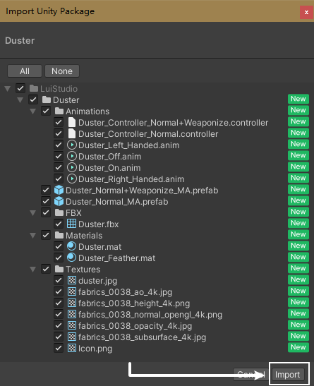

资源包导入结束

---

### 导入普通版本

#### 1. 导入Prefab

将 `Assets/LuiStudio/Duster` 中的 `Duster_Normal_MA.prefab` 拖入 Avatar 中，拖入后 Prefab 与 Avatar 的关系如下：

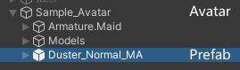

#### 2. 调整鸡毛掸子的位置

##### 1. 显示鸡毛掸子模型

在 Hierarchy 中，选中 Prefab 中的 `Model/Duster`[1]，然后在 Inspector 中将如图的勾选框勾选[2]，显示出鸡毛掸子的模型：

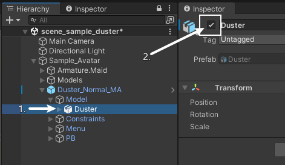

勾选后可以看见鸡毛掸子在右手显示：

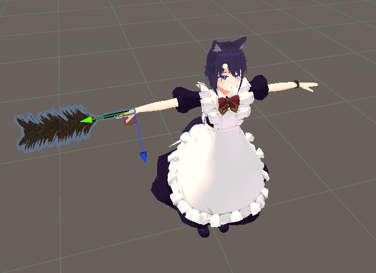

##### 2. 调整位置

在 Hierarchy 中，选中 Prefab 中的 `Constraints/Right_Hand/Right_Hand_Relative`[1]，使用 Unity 的 `移动、旋转` 工具[2]，对鸡毛掸子在右手的位置进行调整：

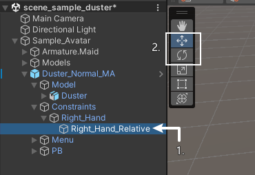

调整到自己满意的位置，如下图：

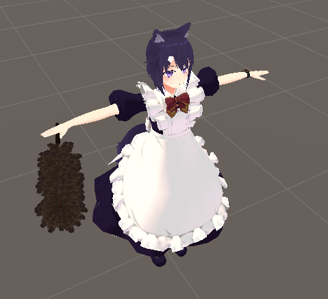

##### 3. 隐藏鸡毛掸子模型

为了防止在 VRChat 预览模型的时候出现鸡毛掸子，我们需要对其进行隐藏（如果您对此不介意，则跳过）
在 Hierarchy 中，选中 Prefab 中的 `Model/Duster`[1]，然后在 Inspector 中将如图的勾选框取消勾选[2]，将鸡毛掸子的模型隐藏：

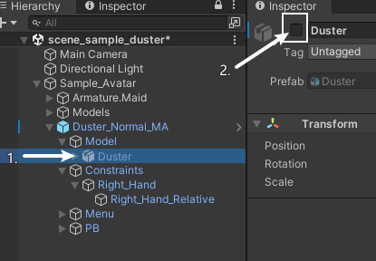

取消勾选后，可以看到鸡毛掸子已经隐藏：

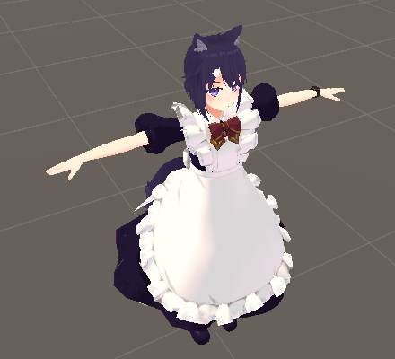

#### 导入完成

鸡毛掸子普通版本导入完成，接下来请查看 [使用方法](#使用方法)

>:warning: **注意**
>
>如果您是跟随 [导入可作为武器使用（倒过来拿）的版本](#导入可作为武器使用倒过来拿的版本) 而完成如上步骤的，请跟随 [下一步骤](#3-调整鸡毛掸子在左手武器状态的位置) 继续进行导入

导入普通版本结束

---

### 导入可作为武器使用（倒过来拿）的版本

#### 1. 导入Prefab

将 `Assets/LuiStudio/Duster` 中的 `Duster_Normal+Weaponize_MA.prefab` 拖入 Avatar 中，拖入后 Prefab 与 Avatar 的关系如下：

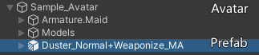

#### 2. 调整鸡毛掸子在右手（普通状态）的位置

请跟随 [普通版本的调整位置步骤](#2-调整鸡毛掸子的位置) 进行调整

#### 3. 调整鸡毛掸子在左手（武器状态）的位置

##### 1. 显示鸡毛掸子模型

参照导入普通版本中的 [显示鸡毛掸子模型](#1-显示鸡毛掸子模型)

##### 2. 将 Avatar 上的 Animator 组件关闭

>:warning: **注意**
>
>该步骤是为了防止 Avatar 模型往预料之外并且无法撤回的情况发展（这是一个 Unity 的 Bug），建议在下一步前保存场景或者进行备份

在 Hierarchy 中选择 Avatar 模型[1]，将 Inspector 中的 `Animator` 组件[2]关闭：

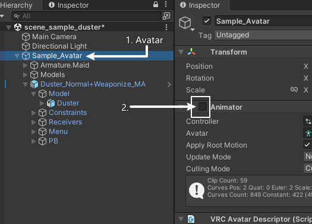

##### 3. 将鸡毛掸子显示在左手

确保 Hierarchy 中选中了 Prefab 中的任意物体，在 Animation 窗口中，选择下拉选单[1]中的 `Duster_Left_Handed`[2]，点击 `Preview`[3]（**请勿点击 Preview 旁边的红色按钮**）：

>:warning: **注意**
>
>如果找不到 Animation 窗口，请右键 Project 窗口标签 -> Add Tab -> Animation

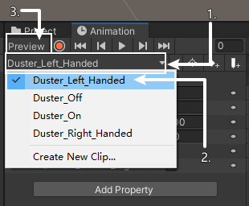

这时可以看见鸡毛掸子移动到了左手：

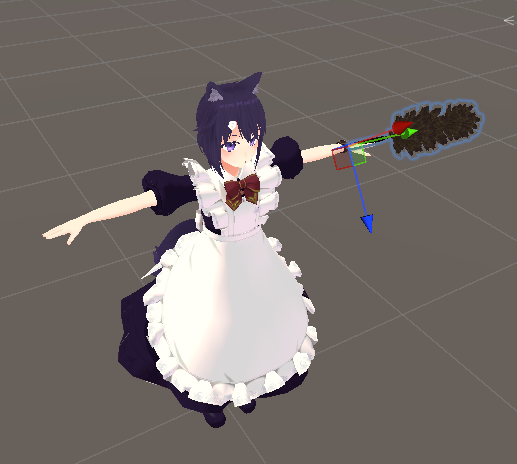

##### 4. 调整位置

在 Hierarchy 中，选中 Prefab 中的 `Constraints/Left_Hand/Left_Hand_Relative`[1]，使用 Unity 的 `移动、旋转` 工具[2]，对鸡毛掸子在左手的位置进行调整：

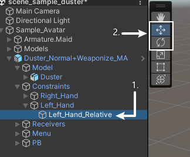

将鸡毛掸子缩小的部位移动到合适的位置，如下图：

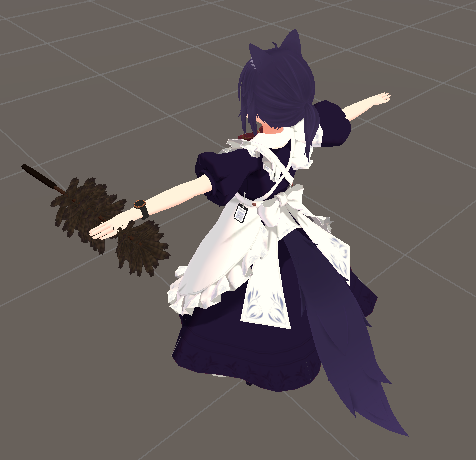

##### 5. 取消预览鸡毛掸子在左手的动画

在 Animation 窗口中，点击 `Preview`[1] 取消预览动画（**请勿点击 Preview 旁边的红色按钮**）：

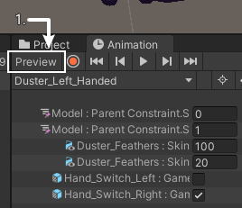

这时能看到鸡毛掸子回到了右手：

##### 6. 重新开启 Avatar 上的 Animator 组件

在 Hierarchy 中选择 Avatar 模型[1]，将 Inspector 中的 `Animator` 组件[2]开启：

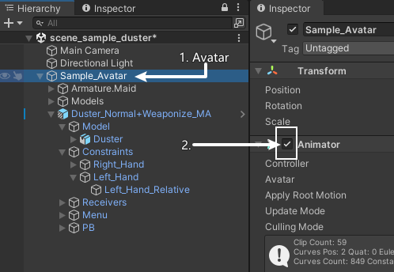

##### 7. 隐藏鸡毛掸子模型

参照导入普通版本中的 [隐藏鸡毛掸子模型](#3-隐藏鸡毛掸子模型)

#### 导入完成

鸡毛掸子可作为武器使用（倒过来拿）的版本导入完成，接下来请查看 [使用方法](#使用方法)

导入可作为武器使用（倒过来拿）的版本结束

---

## 使用方法

你已经完成了导入，接下来将讲解鸡毛掸子在 VRChat 中的使用方法。

### 普通版本使用方法

开启圆盘菜单，找到 Duster 开关以显示/隐藏鸡毛掸子

### 可作为武器使用（倒过来拿）的版本使用方法

除了上述显示/隐藏鸡毛掸子之外：

- 当处于正常握持时，左手移动到鸡毛掸子接近尾部的地方，切换到拳头手势，即可将鸡毛掸子倒过来拿
- 当处于反向握持时，右手移动到鸡毛掸子的手柄处，切换到拳头手势，即可将鸡毛掸子恢复到正常握持

使用方法结束

---

## 杂项

### 修改鸡毛掸子的大小

每个 Avatar 都是特别的，这就需要我们对鸡毛掸子的大小进行适配。

#### 1. 显示鸡毛掸子模型

参照导入普通版本中的 [显示鸡毛掸子模型](#1-显示鸡毛掸子模型)

#### 2. 调整鸡毛掸子大小

选中 Prefab 中的 `Model/Duster`，使用缩放工具或者在 Inspector 中，对鸡毛掸子进行缩放。

#### 3. 隐藏鸡毛掸子模型

参照导入普通版本中的 [隐藏鸡毛掸子模型](#3-隐藏鸡毛掸子模型)

### 修改开关在菜单中的位置

鸡毛掸子的开关默认在菜单的起始层，这对拥有许多功能的 Avatar 来说很不友好，使用 Modular Avatar 可以修改开关的位置

- 选中 Prefab 中的 `Menu/Duster`
- 在 Inspector 中，点击 `MA Menu Installer` 组件中的 `Select Menu` 按钮
- 选择想要将开关放入的子菜单

杂项结束