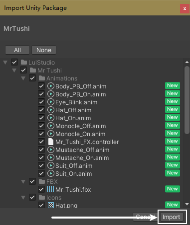
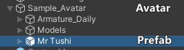
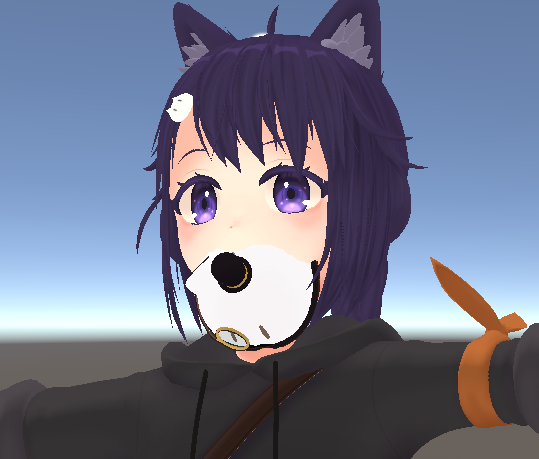
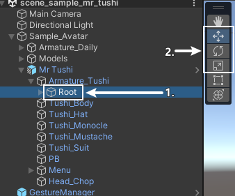

# 图西先生 v1.0 使用说明 {ignore}

## 目录 {ignore}

<!-- @import "[TOC]" {cmd="toc" depthFrom=1 depthTo=6 orderedList=false} -->

<!-- code_chunk_output -->

- [导入教程](#导入教程)
  - [导入前的准备](#导入前的准备)
  - [资源包导入](#资源包导入)
  - [导入图西先生](#导入图西先生)
    - [1. 导入 Prefab](#1-导入-prefab)
    - [2. 调整位置](#2-调整位置)
    - [导入完成](#导入完成)
- [使用方法](#使用方法)
- [杂项](#杂项)
  - [修改子菜单在圆盘菜单中的位置](#修改子菜单在圆盘菜单中的位置)
  - [在 VRChat 的模型预览中隐藏图西先生](#在-vrchat-的模型预览中隐藏图西先生)

<!-- /code_chunk_output -->

## 导入教程

### 导入前的准备

该扩展依赖以下 Unity 插件 / Shader，请在导入前确保已经安装：

- Modular Avatar (1.9.13或以上): https://modular-avatar.nadena.dev/
- lilToon (1.7.3或以上): https://lilxyzw.github.io/lilToon/#/
- Gesture Manager (3.9或以上): https://github.com/BlackStartx/VRC-Gesture-Manager

导入前的准备结束

---

### 资源包导入

将 `Mr Tushi.unitypackage` 拖入 Unity 的 `Project` 窗口中，点击提示窗中的 `Import`，将资源包导入到 Avatar 项目中：

资源包导入结束

---

### 导入图西先生

#### 1. 导入 Prefab

在 Project 窗口中，找到 `Assets/LuiStudio/Mr Tushi/Mr Tushi.prefab`，将其拖入 Hierarchy 窗口中的 Avatar 中，拖入后 Prefab 与 Avatar 的关系如下:

#### 2. 调整位置

在完成上一步后，我们可以在场景中看到图西先生被固定到了头部的骨骼上，如图：

在 Hierarchy 选中 `Mr Tushi/Armature_Tushi/Root`[1]，在场景中使用 `移动工具`、`旋转工具` 和 `缩放工具`[2] 将图西先生移动到头顶：

移动后的位置参考：

#### 导入完成

图西先生导入完成，接下来请查看 [使用方法](#使用方法)

导入教程结束

---

## 使用方法

你已经完成了导入，接下来将讲解图西先生在 VRChat 中的使用方法。
开启圆盘菜单，找到并进入 `Mr.Tushi` 子菜单，菜单中的开关用于显示 / 隐藏相应的模型。

使用方法结束

---

## 杂项

### 修改子菜单在圆盘菜单中的位置

图西先生的子菜单入口默认在菜单的起始层，这对拥有许多功能的 Avatar 来说很不友好，我们可以通过修改 `MA Menu Installer` 组件修改子菜单的位置：

- 在 Hierarchy 中选中 `Mr Tushi/Menu/Mr.Tushi`
- 在 Inspector 中，点击 `MA Menu Installer` 组件中的 `Select Menu` 按钮
- 选择想要将子菜单放入的菜单

### 在 VRChat 的模型预览中隐藏图西先生

在 Hierarchy 中选中以下内容：

- `Mr Tushi/Tushi_Body`
- `Mr Tushi/Tushi_Hat`
- `Mr Tushi/Tushi_Monocle`
- `Mr Tushi/Tushi_Mustache`
- `Mr Tushi/Tushi_Suit`

选中后取消勾选 Inspector 最上方的勾选框。

杂项结束