# 旋转警灯 v1.0 使用说明 {ignore}

## 目录 {ignore}

<!-- @import "[TOC]" {cmd="toc" depthFrom=1 depthTo=6 orderedList=false} -->

<!-- code_chunk_output -->

- [导入教程](#导入教程)
  - [导入前的准备](#导入前的准备)
  - [资源包导入](#资源包导入)
  - [将旋转警灯添加到 Avatar 上](#将旋转警灯添加到-avatar-上)
    - [1. 添加 Prefab](#1-添加-prefab)
    - [2. 配置旋转警灯](#2-配置旋转警灯)
      - [1. Head Only 类型 Prefab 的配置](#1-head-only-类型-prefab-的配置)
        - [1. 调整警灯的位置](#1-调整警灯的位置)
      - [2. Full 类型 Prefab 的配置](#2-full-类型-prefab-的配置)
        - [1. 调整警灯在头上的位置](#1-调整警灯在头上的位置)
        - [2. 调整警灯在手上的位置](#2-调整警灯在手上的位置)
        - [3. 调整手部的 Contact Sender 和头部的 Contact Receiver](#3-调整手部的-contact-sender-和头部的-contact-receiver)
      - [3. 进一步配置](#3-进一步配置)
        - [1. 修改子菜单在圆盘菜单中的位置](#1-修改子菜单在圆盘菜单中的位置)
        - [2. 在 VRChat 的 Avatar 预览中隐藏旋转警灯](#2-在-vrchat-的-avatar-预览中隐藏旋转警灯)
        - [3. 调整旋转警灯开启时的音效和音量](#3-调整旋转警灯开启时的音效和音量)
- [使用方法](#使用方法)
  - [显示和隐藏旋转警灯](#显示和隐藏旋转警灯)
  - [在头和手之间移动旋转警灯（仅针对 Full 版本）](#在头和手之间移动旋转警灯仅针对-full-版本)
  - [启用和禁用旋转警灯](#启用和禁用旋转警灯)

<!-- /code_chunk_output -->

## 导入教程

### 导入前的准备

该扩展依赖以下 Unity 插件 / Shader，请在导入前确保已经安装：

- Modular Avatar (1.11.0或以上): https://modular-avatar.nadena.dev/
- lilToon (1.8.3或以上): https://lilxyzw.github.io/lilToon/#/

---

### 资源包导入

将 `Rotating Beacon.unitypackage` 拖入 Unity 的 `Project` 窗口中，点击提示窗中的 `Import`，将资源包导入到 Avatar 项目中：

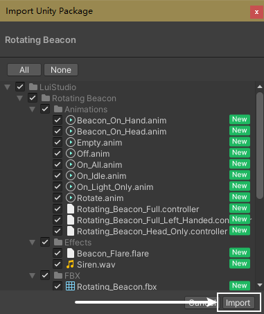

---

### 将旋转警灯添加到 Avatar 上

#### 1. 添加 Prefab

该商品根据使用需求，分出了不同类型的 Prefab，请根据自身需求选择下列 Prefab：

- `Rotating Beacon(Head Only)` - 警灯将一直在头上
- `Rotating Beacon(Full)` - 警灯可以拿在*右手*上，并且可以从*右手*放到头上
- `Rotating Beacon(Full)(Left_Handed)` - 警灯可以拿在*左手*上，并且可以从*左手*放到头上

其中，`Full` 类型的 Prefab 比 `Head Only` 类型的 Prefab 多出一个同步参数（3 bits -> 4 bits），并使用了 `Contact Sender` 和 `Contact Receiver` 以及 `VRC Parent Constraint`。建议 PC 玩家或者对性能有要求的玩家使用 `Head Only` 类型的 Prefab。

>:warning: **注意**
>
>请仔细选择 `Full` 类型的左右手 Prefab。不同手的 Prefab 对手势的判断不同，如果添加了一只手的 Prefab 后将警灯置于另一只手上，会导致拿取时出现问题。

将您选择的 Prefab，从 Project 窗口中拖拽到 Hierarchy 中您的 Avatar 下。拖入完成后，Prefab 与 Avatar 的关系如下（这里以 `Rotating Beacon(Full)` 为例）：

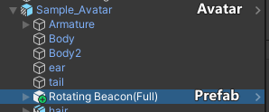

#### 2. 配置旋转警灯

##### 1. Head Only 类型 Prefab 的配置

在拖入 Prefab 后，场景中的警灯会出现在离地面 1.5m 的高度：

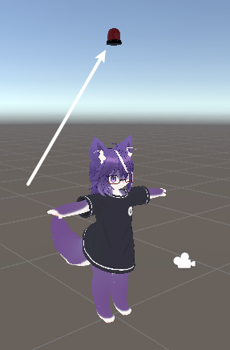

###### 1. 调整警灯的位置

在 Hierarchy 中，选中 `Prefab/Model`[1]，使用 `移动`、`旋转` 和 `缩放` 工具[2]调整其位置和大小：

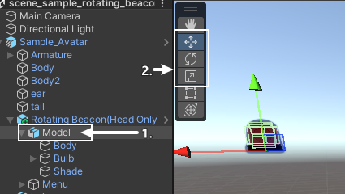

让警灯置于 Avatar 的头顶：

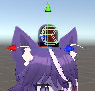

完成后，请查看 [进一步配置](#3-进一步配置)。

##### 2. Full 类型 Prefab 的配置

该部分以 `Rotating Beacon(Full)` 为例，即右手为例。

在添加 Prefab 后，场景中会有一个距离地面 1.5m 高度的警灯，还有一个黄色的球形 Contact Sender 在对应手的方向附近：

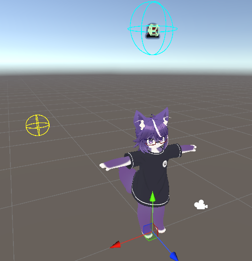

###### 1. 调整警灯在头上的位置

选中 Hierarchy 中的 `Prefab/Constraint Parents/Head`[1]，在场景中使用 `移动`、`旋转` 和 `缩放` 工具[2]调整其位置和大小：

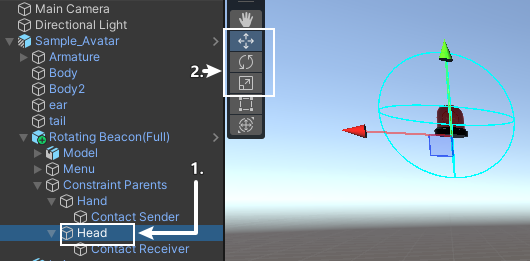

将警灯置于 Avatar 的头顶：

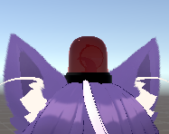

###### 2. 调整警灯在手上的位置

由于 `Full` 类型 Prefab 可以使警灯在手上和头上之间切换，我们需要调整警灯在相应手上的位置。

在 Hierarchy 中选择 `Prefab/Model`[1]，转到 Inspector 窗口，将 `VRC Parent Constraint`[2] 组件下的 `Sources` 列表中，`Element 0 [Head]` 的 `Weight` 改为 `0`[3]，然后将 `Element 1 [Hand]` 的 `Weight` 改为 `1`[4]：

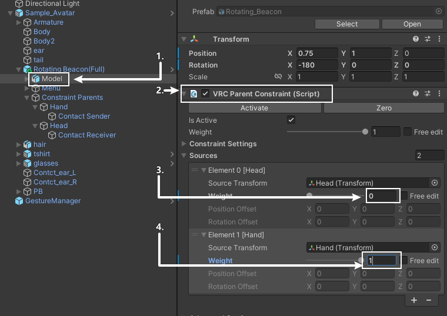

这时我们可以看到，场景中的警灯移动到了相应手的附近：

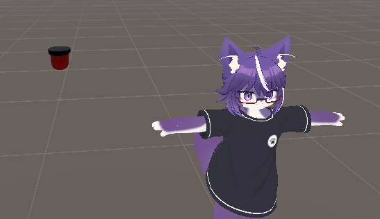

回到 Hierarchy，选中 `Prefab/Constraint Parents/Hand`，将警灯移动到手上。位置参考：

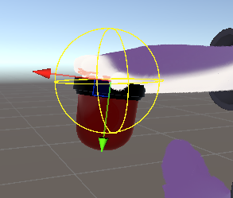

###### 3. 调整手部的 Contact Sender 和头部的 Contact Receiver

手部的 Contact Sender 和头部的 Contact Receiver 用于在将旋转警灯在手和头之间移动时进行区域判断。我们需要根据 Avatar 的手部和头部的位置和大小进行调整，一般情况下，比手和头稍大一些能够保证区域判断不会太严格（如果太小，在使用 VR 头显时，可能会由于手柄定位问题导致 Contact Sender 无法接触到 Contact Receiver）。

选择 Hierarchy 中的 `Prefab/Constraint Parents/Hand/Contact Sender`，在场景中使用 `移动` 和 `缩放` 工具（或者在 Contact Sender 组件中调整 Position 和 Radius）调整 Sender 的位置和大小。调整参考：

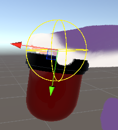

在 Hierarchy 中，选中 `Prefab/Constraint Parents/Head/Contact Receiver`，在场景中使用 `移动` 和 `缩放` 工具（或者在 Contact Receiver 组件中调整 Position 和 Radius）调整 Receiver 的位置和大小。调整参考：

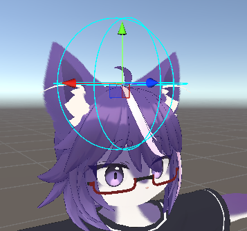

##### 3. 进一步配置

###### 1. 修改子菜单在圆盘菜单中的位置

旋转警灯的子菜单入口默认在根菜单下，这对拥有许多功能的 Avatar 来说很不友好。我们可以通过修改 `MA Menu Installer` 组件修改子菜单的位置：

- 在 Hierarchy 中选中 `Prefab/Menu/Rotating Beacon`
- 在 Inspector 中，点击 `MA Menu Installer` 组件中的 `Select Menu` 按钮
- 选择想要将子菜单放入的菜单

###### 2. 在 VRChat 的 Avatar 预览中隐藏旋转警灯

VRChat 的 Avatar 预览展示的是 Unity 中 Avatar 最后的状态。也就是说，如果在 Unity 中没有禁用旋转警灯，在 VRChat 中预览 Avatar 时也会显示。可以通过以下步骤在 Unity 和 VRChat 预览中隐藏旋转警灯：

- 在 Hierarchy 中选中 `Prefab/Model`
- 取消勾选 Inspector 最上方的勾选框（禁用旋转警灯）

###### 3. 调整旋转警灯开启时的音效和音量

在 Hierarchy 中找到 `Prefab/Model/Bulb/Audio`，在 Inspector 窗口找到 `Audio Source` 组件。如果需要更换音效，则将导入到 Unity 的新音效拖入组件中的 `AudioClip` 一栏；如果需要调整音量，请调整组件中的 `Volume`。

导入教程结束

---

## 使用方法

您已经完成了旋转警灯的导入，接下来我将讲解如何在 VRChat 中使用旋转警灯。

### 显示和隐藏旋转警灯

开启圆盘菜单，找到并进入 `Rotating Beacon` 子菜单，子菜单中的 `Rotating Beacon` 按钮用于显示/隐藏旋转警灯。

### 在头和手之间移动旋转警灯（仅针对 Full 版本）

显示旋转警灯后，旋转警灯可以在头上或手上：

- 旋转警灯在手上时，保证手势不是张开的同时，将手移动到头上（具体来说是头部的 Contact Receiver 中），然后将手张开，即可将旋转警灯放置到头顶。
- 旋转警灯在头顶时，保证手势不是握拳的同时，将手移动到头上（具体来说是头部的 Contact Receiver 中），然后将手握拳，即可将旋转警灯拿到手上。

除了上述方式外，也可以使用 `Rotating Beacon` 子菜单中的 `On Head` 开关来切换旋转警灯的位置。

### 启用和禁用旋转警灯

在 `Rotating Beacon` 子菜单中，`Activate` 开关用来启用和禁用旋转警灯，同时 `Siren` 开关用来开关启用时的警笛音效。

使用方法结束